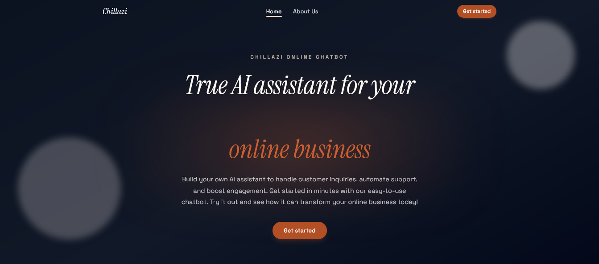
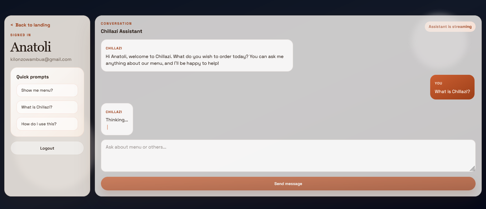

# 🤖 CHillazi Smart AI Assistant — Helpdesk & Waiter System



<!-- Screenshots are included from /screenshots as requested -->

An intelligent conversational AI assistant built in **Python (FastAPI)** with **MySQL** that acts as both a **helpdesk agent** and a **virtual waiter**. It chats naturally with customers, takes food orders, confirms them, and manages order status—powered by an **LLM integration** in the backend.

---



## 🚀 Features

### 🧠 Conversational AI

- Natural chat experience (menu questions, order questions, helpdesk inquiries).
- Conversation context maintained for ongoing interactions.
- Clean chat UI with streaming/“thinking” states.

### 🍔 Smart Order Flow

- Assist users in creating food orders through conversation.
- Helps confirm intent (e.g., when the user indicates they are done ordering).
- Generates structured order information and stores it in the backend database.

### 💬 Helpdesk Mode

- Answers common helpdesk questions (menu, order status, etc.).
- Uses recent conversation context to remain coherent.

### 💾 Data Persistence

- Stores key data including users, conversations/chats, carts, and orders.
- Backend uses prepared statements / ORM patterns to protect data interactions.

---

## 🧩 Architecture Overview

```text
backend/
├── app/
│   ├── main.py                         # FastAPI entrypoint
│   ├── api/routes/                    # REST API routes (chat, menu, order, cart, auth)
│   ├── agents/                       # LLM agent + memory
│   ├── services/                     # Business logic (menu, cart, order, chat)
│   ├── models/                       # Database models
│   └── tools/                        # Helper tools for menu/cart/order
└── requirements.txt

frontend/
├── src/
│   ├── pages/                         # landing, login, signup, chat, admin
│   ├── services/                     # API client wrappers
│   └── components/                   # shared UI components
```

---

## 🖼️ Screenshots

- Landing page: `screenshots/Landing page.png`
- Login: `screenshots/login.png`
- Sign up: `screenshots/sign up.png`
- Chat panel: `screenshots/chat panel.png`
- Admin dashboard: `screenshots/admin dashboard.png`

---

## ✅ Requirements

- **Python 3.10+** (backend)
- **MySQL** (database)
- **Composer / npm** not required (project uses Python + Vite/React)
- An LLM provider configuration via backend environment variables

---

## ⚙️ Setup (Local)

### 1) Backend

1. Go to `backend/`
2. Configure environment variables:
   - Copy `backend/.env` (or create one) with required settings for:
     - `jwt_secret_key`
     - database connection (`db_host`, `db_port`, `db_name`, `db_user`, `db_pass`)
     - LLM provider keys (depending on your chosen provider)
3. Install dependencies:

```bash
pip install -r backend/requirements.txt
```

4. Run the server (example):

```bash
uvicorn app.main:app --reload
```

### 2) Frontend

1. Go to `frontend/`
2. Configure `VITE_API_URL` so the frontend can reach the backend.
3. Install dependencies:

```bash
npm install
```

4. Run the dev server:

```bash
npm run dev
```

---

## 🧾 Database (High-level)

The backend stores data such as:

- **Users**
- **Menu items** (via JSON / DB models)
- **Carts**
- **Orders**
- **Chat messages / conversation context**

(See backend models and services for exact schemas.)

---

## 📌 Deployment

This repository is compatible with Docker and Render. Example configuration is provided in `render.yaml`.

---

## 🧑‍💻 Author

**Antony Kilonzo Wambua**

- IT Staff & Web Developer
- Machakos, Kenya
- [kilonzowambua254@gmail.com](mailto:kilonzowambua254@gmail.com)
- [LinkedIn](https://www.linkedin.com/in/antony-wambua-293459265/)
- [GitHub](https://github.com/AKW254)

---

## 📝 License

MIT License © 2025 Antony Kilonzo Wambua
